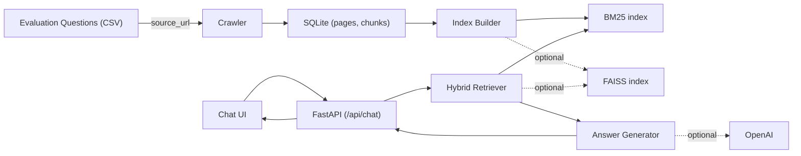

# THSS RAG Chatbot

RAG challenge implementation for answering questions about the Tsinghua School of
Software website.

## Goal

Build a production-grade Retrieval-Augmented Generation (RAG) chatbot over the
Tsinghua School of Software (THSS) website corpus, returning source-grounded
answers with citations.

## Features

This repository currently contains the RAG application foundation:

- FastAPI backend
- Static HTML/CSS/JS chat UI
- Demo login flow
- SQLite crawler data ingestion
- BM25 chunk indexing and retrieval
- Retrieval-grounded chat responses with optional OpenAI generation

## Tech Stack

- Backend API: FastAPI + Uvicorn
- Configuration: `python-dotenv` + `pydantic-settings`
- Crawling & Parsing: `httpx` + `beautifulsoup4` + `lxml`
- Storage: SQLite (`data/rag.sqlite3`)
- Retrieval: BM25 (`rank-bm25`) + optional vector index (OpenAI Embeddings + `faiss-cpu`)
- Tokenization: `jieba`
- LLM: `openai` (optional, with fallback behavior)
- Frontend: plain static HTML/CSS/JS served by FastAPI

## Architecture



```text
Crawler -> SQLite -> Chunker -> BM25 + Vector Index -> Retriever -> LLM -> FastAPI -> Static Chat UI
```

## Quick Start

See [Local Development](docs/Local-Development.md) for Python/Docker setup and
local run commands.

## Deployment

For a manual deployment walkthrough on a remote server, see
[Manual Deployment](docs/Deployment-Manual.md).

## Crawl & Index

- Crawl pages into SQLite: [Crawler Data Ingestion](docs/Crawler-Data-Ingestion.md)
- Build retrieval indexes: [Indexing And Retrieval](docs/Indexing-and-Retrieval.md)

## Chat Pipeline

The chat API retrieves source chunks and returns citation-backed answers. See
[Chat Pipeline](docs/Chat-Pipeline.md) for the request flow, fallback behavior,
and API output shape.

## Evaluation

See [Evaluation](docs/Evaluation.md) for:

- Fetching the evaluation question set from the remote questions page into a local CSV.
- Crawling Source URLs and building indexes.
- Running `scripts/eval_questions.py` and collecting reports.

## Known Limitations

- Session storage is in-memory. Sessions are cleared when the server restarts.
- Vector retrieval is optional and cost-sensitive. It requires OpenAI embeddings and is disabled unless explicitly enabled and configured.
- The crawler and indexes generate local artifacts under `data/` which must not be committed.
- The synthetic evaluation dataset generator is for debugging only and is not the official evaluation question set.

## Challenge Constraints

- Ethical crawling: respect `robots.txt`, use a clear User-Agent, and keep rate
  limits conservative.
- No data redistribution: do not commit raw crawled corpus, databases, or
  generated indexes.
- No secrets in Git: keep `.env`, server credentials, and API keys out of the
  repository.
- Cost control: vector retrieval requires query-time embeddings. It is disabled
  by default unless explicitly enabled and properly configured.

## Notes

- Raw crawled corpus and generated indexes should stay under `data/` and should
  not be committed. The evaluation dataset is generated locally into
  `data/evaluation_questions.csv`.
- Demo credentials are configured through `.env`.
- The first implementation uses FastAPI-hosted static HTML/CSS/JS. A Vue
  rewrite can be added later without changing the RAG API.
