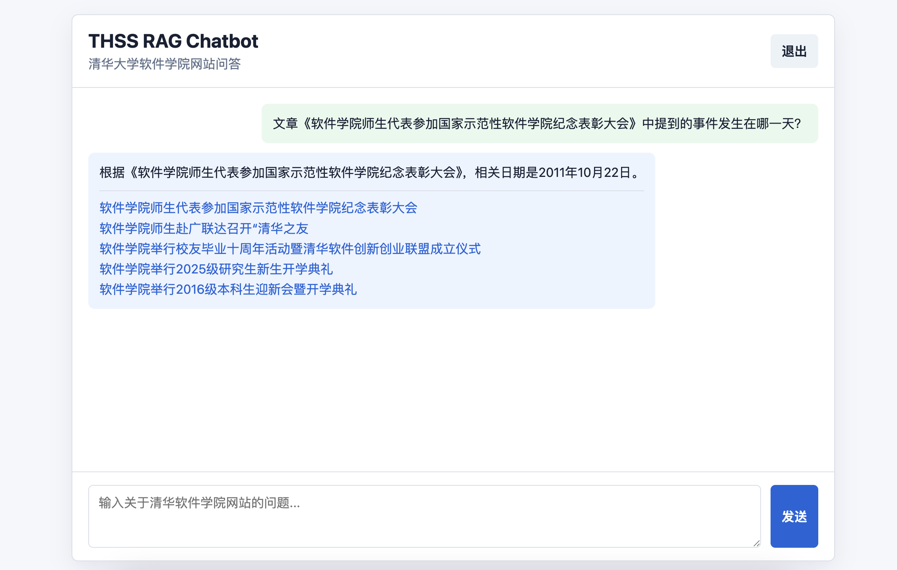
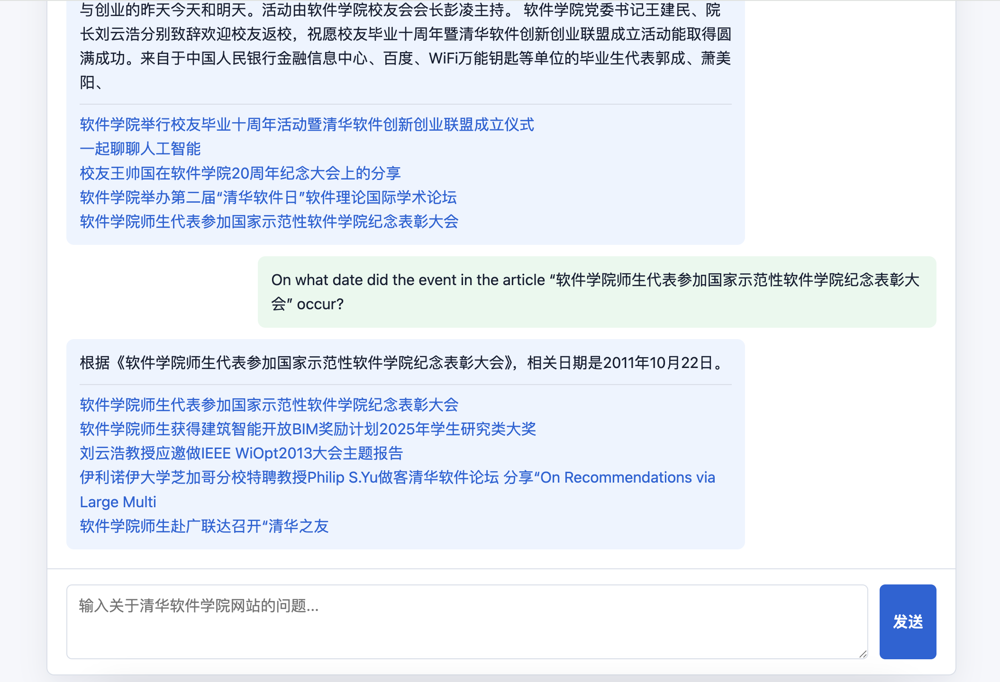

# Chat Pipeline

This document describes the third RAG milestone: connecting retrieval results to
the chat API so the web UI can return source-backed answers.

## Goal

The chat pipeline turns a user message into a retrieval-grounded response.

```text
User question -> HybridRetriever -> top-k chunks -> AnswerGenerator -> ChatResponse
```

## Step 1: Build The Retrieval Index

The chat pipeline expects a local BM25 index:

```bash
python scripts/build_index.py
```

Output:

- `data/index/bm25.pkl`
- `chunks` and `index_metadata` tables in `data/rag.sqlite3`

If the index file does not exist, `/api/chat` returns a clear setup message
instead of failing with a server error.

## Step 2: Retrieve Contexts

`app/rag/pipeline.py` calls `HybridRetriever.retrieve(...)` for each user
message.

Output:

- Ranked source chunks.
- Source title, URL, snippet, score, date, and category.

## Step 3: Generate An Answer

`AnswerGenerator` uses two generation paths:

- If `OPENAI_API_KEY` is configured, it sends the question and retrieved
  contexts to the configured chat model.
- If no key is configured, or the API call fails, it returns a local fallback
  answer based on the top retrieved snippet.

The fallback path keeps the application usable during local development and
deployment debugging.

Output:

- A concise answer grounded in retrieved context.
- No repeated source URLs in the text because the API response includes
  structured sources.

## Step 4: Return Sources To The UI

The FastAPI `/api/chat` endpoint returns:

```json
{
  "answer": "...",
  "sources": [
    {
      "title": "...",
      "url": "https://www.thss.tsinghua.edu.cn/...",
      "snippet": "..."
    }
  ]
}
```

The static chat UI already renders `sources` as clickable links below the
assistant message.

## Milestone Output

After this step, the chat API no longer returns a skeleton response. It retrieves
from the local THSS index and returns citation-backed answers.

Chinese UI test result:



English UI test result:



## Test Questions

Use these questions to smoke-test retrieval, fallback generation, and source
link rendering in the chat UI.

Chinese:

1. 文章《软件学院师生代表参加国家示范性软件学院纪念表彰大会》中提到的事件发生在哪一天？
2. 《软件学院党委书记为2023级本科新生讲党课》这篇报道主要讲述了哪方面的工作？
3. 文章《软件学院举行校友毕业十周年活动暨清华软件创新创业联盟成立仪式》中提到了多少人或团队参与？

English:

1. On what date did the event in the article “软件学院师生代表参加国家示范性软件学院纪念表彰大会” occur?
2. What aspect of work does the report “软件学院党委书记为2023级本科新生讲党课” mainly describe?
3. How many people or teams were mentioned as participating in “软件学院举行校友毕业十周年活动暨清华软件创新创业联盟成立仪式”?
