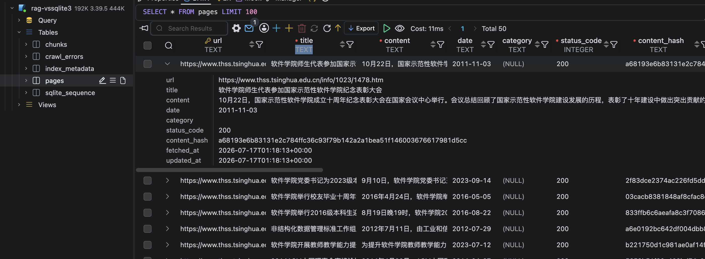

# Crawler Data Ingestion

This document describes the first RAG data-ingestion milestone: crawling source
pages from the evaluation question set, cleaning article content, and storing the
result in SQLite for later indexing.

## Goal

The crawler turns evaluation question Source URLs into structured rows in the
local RAG database.

```text
Evaluation-Questions.md -> Source URLs -> THSS pages -> cleaned text -> SQLite
```

## Run From Evaluation Sources

### Step 1: Extract Source URLs

Use the Source URLs embedded in the evaluation question markdown file.

```bash
python scripts/crawl.py --from-eval docs/Evaluation-Questions.md --limit 50
```

To preview the URLs without making network requests:

```bash
python scripts/crawl.py --from-eval docs/Evaluation-Questions.md --dry-run
```

Output:

- A deduplicated list of THSS article URLs from `docs/Evaluation-Questions.md`.

### Step 2: Crawl Or Re-Crawl Pages

To re-crawl URLs that already exist in the database:

```bash
python scripts/crawl.py --from-eval docs/Evaluation-Questions.md --force
```

To crawl one page directly:

```bash
python scripts/crawl.py --url https://www.thss.tsinghua.edu.cn/info/1023/1478.htm
```

Output:

- Raw page HTML fetched from the THSS website.
- Cleaned article fields: title, date, category, URL, and content.

### Step 3: Store Results In SQLite

The default database path is:

```text
data/rag.sqlite3
```

The crawler creates two tables:

- `pages`: successfully crawled and cleaned pages.
- `crawl_errors`: failed URLs and error details for retry/debugging.

The `pages` table stores:

- `url`
- `title`
- `content`
- `date`
- `category`
- `status_code`
- `content_hash`
- `fetched_at`
- `updated_at`

Output:

- `data/rag.sqlite3`
- One row per successfully crawled source page in `pages`.
- One row per failed URL in `crawl_errors`.

## Crawler Behavior

The crawler is intentionally conservative:

- It only crawls the configured source domain.
- It checks `robots.txt` by default.
- It sends a clear User-Agent.
- It rate-limits requests.
- It upserts pages by URL.
- It removes successful URLs from `crawl_errors`.

## Step 4: Review The Milestone Output

After this step, the project has a populated `pages` table with cleaned page
content and article titles that can be used by the next indexing phase.

Output:

- `data/rag.sqlite3`
- A populated `pages` table containing cleaned source pages.
- Corrected article titles in `pages.title`.
- A `crawl_errors` table for failed URLs that need retry or investigation.


