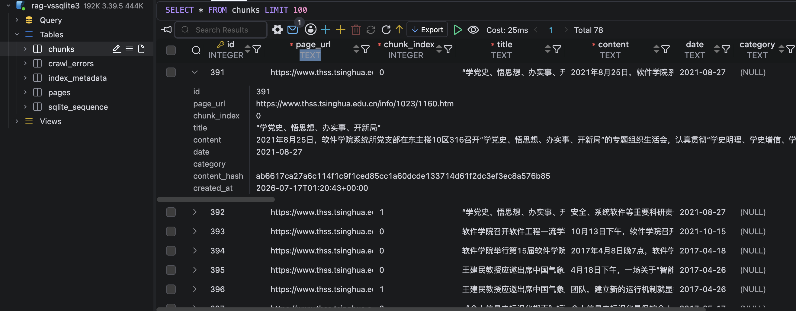
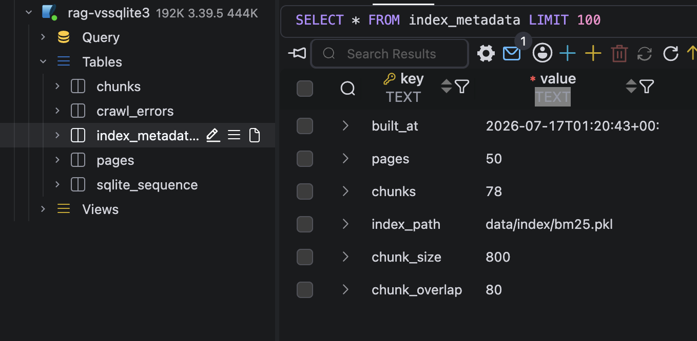

# Indexing And Retrieval

This document describes the second RAG milestone: converting crawled pages into
retrievable chunks and building keyword + embedding indexes for source-grounded search.

## Goal

The indexing phase turns cleaned pages into chunk-level search results.

```text
SQLite pages -> chunks table -> BM25 + FAISS index -> top-k source snippets
```

## Prerequisites

- Crawl THSS pages into `data/rag.sqlite3` first (see
  [Crawler Data Ingestion](Crawler-Data-Ingestion.md)).
- Generate `data/evaluation_questions.csv` if you want title overrides (see
  [Evaluation Questions Generation](Evaluation-Questions-Generation.md)).

## Step 1: Build Chunks And BM25 Index

Run the index builder after crawling pages:

```bash
python scripts/build_index.py
```

The builder reads from:

```text
data/rag.sqlite3
```

It writes:

- `chunks` table in `data/rag.sqlite3`
- `index_metadata` table in `data/rag.sqlite3`
- `data/index/bm25.pkl`
- `data/index/faiss.index` (only when `--with-vector` is set and `OPENAI_API_KEY` is available)

Output:

- One or more chunks per crawled page.
- A persisted BM25 index paired with chunk metadata.
- Build metadata such as page count, chunk count, chunk size, and index path.

The `chunks` table contains chunk-level retrieval records generated from
`pages`.



## Step 2: Repair Evaluation Titles

Some THSS pages expose share-widget text where an article title is expected. The
index builder uses `data/evaluation_questions.csv` as an optional title override
source by matching each question's Source URL.
Generate the CSV locally if it is missing (see `docs/Evaluation-Questions-Generation.md`).

This helps title-heavy evaluation questions such as:

```text
文章《软件学院师生代表参加国家示范性软件学院纪念表彰大会》中提到的事件发生在哪一天？
```

Output:

- Better `chunks.title` values for pages whose crawled title is missing or noisy.
- Stronger retrieval for questions that include article titles.

## Step 3: Run A Retrieval Smoke Test

Use `--query` to build the index and immediately test retrieval:

```bash
python scripts/build_index.py \
  --query '文章《软件学院师生代表参加国家示范性软件学院纪念表彰大会》中提到的事件发生在哪一天？' \
  --top-k 3
```

Example output shape:

```text
Index build complete: pages=50, chunks=78, database=data/rag.sqlite3, index=data/index/bm25.pkl

Top 3 result(s) for: ...
1. score=... title=软件学院师生代表参加国家示范性软件学院纪念表彰大会 url=https://www.thss.tsinghua.edu.cn/info/1023/1478.htm
```

Output:

- Ranked source snippets.
- Article title and URL for each result.
- BM25 score for debugging retrieval quality.

The `index_metadata` table records the generated index path and build settings.



## Step 4: Use The Retriever In Code

The application can retrieve source snippets through `HybridRetriever`:

```python
from app.rag.retriever import HybridRetriever

retriever = HybridRetriever()
results = retriever.retrieve("文章《软件学院师生代表参加国家示范性软件学院纪念表彰大会》中提到的事件发生在哪一天？")
```

Each result contains:

- `title`
- `url`
- `snippet`
- `score`
- `date`
- `category`
- `chunk_id`
- `chunk_index`

## Retrieval Strategy (Current)

`HybridRetriever` ranks chunks using:

- BM25 keyword search over chunk text.
- A title boost when the query contains (or closely matches) the page title.
- Optional FAISS vector similarity when:
  - `data/index/faiss.index` exists, and
  - `OPENAI_API_KEY` is configured (query-time embeddings), or vector retrieval is explicitly forced.

When enabled, the current implementation merges candidates using the weighted
score described in the implementation plan (title 0.5, BM25 0.3, vector 0.2).

## Milestone Output

After this step, the project can retrieve relevant source snippets from crawled
THSS pages. The next milestone is to connect these retrieval results to
`app/rag/pipeline.py` so the chat API returns citation-backed answers.

Output:

- `chunks` table populated from corrected `pages` records.
- `index_metadata` table recording the latest build.
- `data/index/bm25.pkl` for runtime retrieval.
